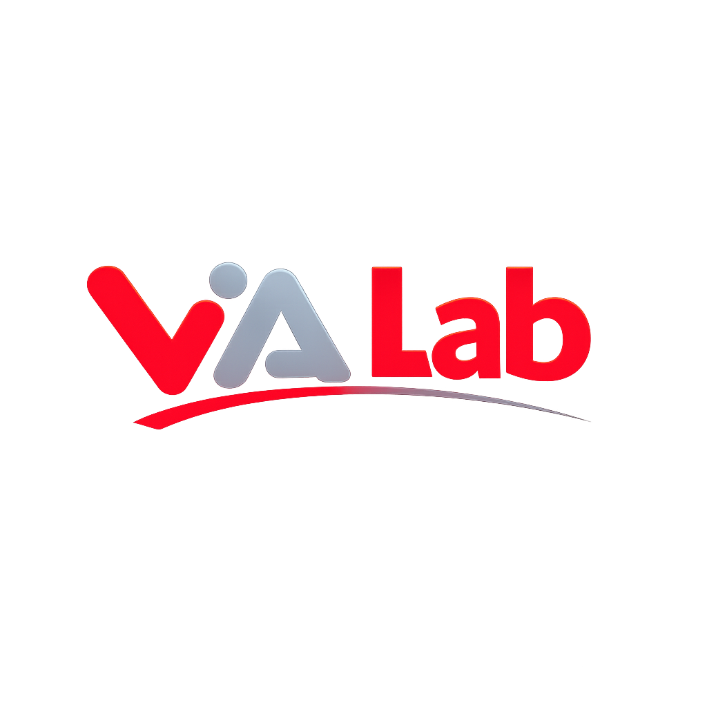

<p align="center">
  
</p>

<h1 align="center">ViaLab — Dijital Çözümler & Yazılım</h1>

<p align="center">
  Turizm, ulaşım, etkinlik, eğitim ve mobil sektörlerine özel<br>
  modern, ölçeklenebilir yazılım çözümleri üretiyoruz.
</p>

<p align="center">
  
  
  
  
  
  
  
  
  
</p>

---

## Hakkımızda

**ViaLab**, sektöre özel dijital çözümler geliştiren bir teknoloji firmasıdır. Full-stack web uygulamalarından API entegrasyonlarına, cloud mimarilerden mobil uyumlu tasarımlara kadar geniş bir yelpazede hizmet veriyoruz.

## Projelerimiz

| # | Proje | Sektör | Teknolojiler |
|---|-------|--------|-------------|
| 1 | Transfer Yönetim Sistemi | Ulaşım & Lojistik | React, Supabase, Google Maps, Leaflet |
| 2 | Seyahat & Tur Platformu | Turizm & Rezervasyon | React, Supabase, Edge Functions |
| 3 | Kurumsal Etkinlik Platformu | MICE & Organizasyon | Next.js 15, Supabase, shadcn/ui |
| 4 | Booking.com Sürücü Uygulaması | Mobil & Ulaşım | React Native, Expo, Supabase, Google Maps |
| 5 | StudyCoachAI - AI Çalışma Koçu | Eğitim & Yapay Zeka | Swift, React, Claude AI, Supabase |
| 6 | ViaGo - Transfer Platformu | Kurumsal SaaS | React, Supabase, AWS, Google Maps |
| 7 | iOS Uygulama Geliştirme | Mobil & iOS | Swift, React Native, Expo, Firebase |

## Teknoloji Yığını

### Frontend
- **React** — Bileşen tabanlı UI geliştirme
- **Next.js 15** — SSR/SSG ile performanslı web uygulamaları
- **TypeScript** — Tip güvenli geliştirme
- **Tailwind CSS** — Utility-first CSS framework
- **Vite** — Hızlı build & HMR

### Backend & Veritabanı
- **Supabase** — Backend as a Service (Auth, Realtime, Storage)
- **PostgreSQL** — İlişkisel veritabanı (RLS, Triggers, CRON)
- **Deno Edge Functions** — Serverless API'ler
- **Vercel** — Deployment & hosting

### Mobil
- **React Native / Expo** — Cross-platform mobil uygulama
- **Swift** — Native iOS geliştirme
- **Firebase** — Push Notification, Analytics

### Entegrasyonlar
- Google Maps API, Leaflet, Booking.com API, İyzico, UETDS, Resend, Web Push

## Web Sitesi Özellikleri

Bu repository, ViaLab'ın kurumsal tanıtım web sitesini içerir:

- **Particle ağ animasyonu** — İnteraktif Canvas tabanlı bağlantı ağı
- **Matrix rain efekti** — Hakkımızda bölümünde akan kod animasyonu
- **Orbit eden teknoloji ikonları** — Hero bölümünde dönen SVG ikonlar
- **Terminal/IDE temalı iletişim** — VS Code benzeri form arayüzü
- **Typing efekti** — Otomatik yazılan badge metinleri
- **Kod bracket navigasyon** — `<Menü />` tarzı hover efektleri
- **Mega-menü dropdown'ları** — Projeler, teknolojiler önizlemesi
- **Tam responsive** — Mobil, tablet ve masaüstü uyumlu

## Kurulum

```bash
# Repo'yu klonlayın
git clone https://github.com/tuncasoftbildik/ViaLab.git
cd ViaLab

# Herhangi bir HTTP sunucu ile çalıştırın
python3 -m http.server 8080
# veya
npx serve .
```

Tarayıcıda `http://localhost:8080` adresini açın.

## Dosya Yapısı

```
ViaLab/
├── index.html          # Ana sayfa (tüm bölümler)
├── css/
│   └── style.css       # Stiller, animasyonlar, responsive
├── js/
│   └── main.js         # Particle canvas, matrix rain, typing efekti
├── assets/
│   └── logo.png        # ViaLab logosu
└── README.md
```

## Lisans

© 2026 ViaLab. Tüm hakları saklıdır.
